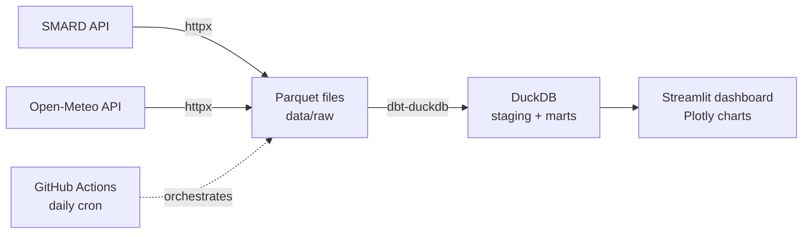

# Energy & Weather Pipeline

End-to-end data pipeline that pulls German electricity market data (SMARD) and weather data (Open-Meteo) daily, transforms them with dbt on DuckDB and serves a Streamlit dashboard answering one question: how do wind and sun drive electricity prices and the generation mix?

<!-- TODO: dashboard screenshot + link to the live demo -->


<!-- TODO: GitHub Actions status badge once the workflow exists -->

## Architecture



## Findings

<!-- TODO: 2-3 findings from the data once the dashboard is up -->

## Setup

```bash
python3.12 -m venv .venv --prompt energy-pipeline
source .venv/bin/activate
pip install -r requirements.txt
```

<!-- TODO: backfill command + dashboard start once they exist -->

## Design Decisions

<!-- TODO: DuckDB vs Postgres, Parquet as raw format, GitHub Actions vs Airflow -->

## Next Steps

<!-- TODO -->
