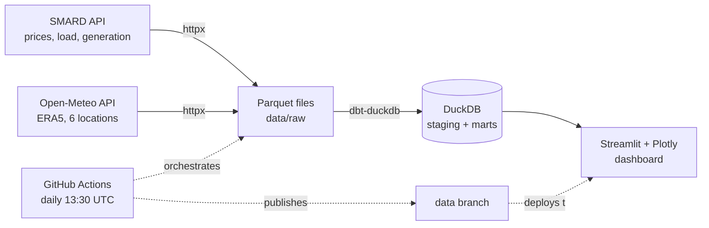

# Energy & Weather Pipeline

End-to-end ELT pipeline that ingests German day-ahead electricity prices and the
power generation mix (SMARD, Bundesnetzagentur) together with weather data
(Open-Meteo, ERA5) every day, transforms them with dbt on DuckDB and serves a
Streamlit dashboard around one question: how do wind and sun drive German
electricity prices and the generation mix?

**[Live demo](https://energy-weather-pipeline.streamlit.app)**

<!-- Add a dashboard screenshot at docs/dashboard.png, then replace this comment with:

-->

[](https://github.com/LogicalLizard/energy-weather-pipeline/actions/workflows/pipeline.yml)


## Architecture



The daily workflow restores previously collected data, ingests only the weeks
that are new or still subject to corrections (idempotent, one parquet file per
series and week), rebuilds the dbt models and runs 17 data tests. Only if the
tests pass is the result force-pushed to the `data` branch, which Streamlit
Community Cloud uses as its deploy source - data that fails validation never
reaches the dashboard, and history accumulates beyond the initial 90-day backfill.

## Findings (data since May 2026, numbers as of 2026-08-02)

- **Solar sets the price rhythm.** Hourly solar radiation and day-ahead price
  correlate at -0.62. Between 12:00 and 15:00 (Europe/Berlin) prices averaged
  28 EUR/MWh against 183 EUR/MWh in the evening peak (19:00-22:00) - the
  merit-order effect is clearly visible in a single summer of data.
- **Negative prices are a renewables phenomenon.** 191 of the ~2,180 hours so
  far cleared below 0 EUR/MWh. In those hours wind and solar fed in 52 GWh/h on average,
  roughly twice the overall average of 27 GWh/h.
- **Wind matters less in summer.** Wind generation correlates with price at
  only -0.22 (wind speed: -0.17) over this period - the summer months are
  simply calm. A full winter of data should strengthen this relationship
  considerably.

## Setup

```bash
python3.12 -m venv .venv --prompt energy-pipeline
source .venv/bin/activate
pip install -r requirements.txt
python -m src.ingestion.smard                              # 90-day backfill
python -m src.ingestion.open_meteo
dbt run --project-dir dbt --profiles-dir dbt
streamlit run dashboard/app.py
```

`pytest` runs the ingestion tests, `dbt test --project-dir dbt --profiles-dir dbt`
the data tests.

## Design decisions

- **DuckDB instead of Postgres.** A single file, no server to run, reads the
  raw parquet directly, and the whole transform finishes in under a second.
  Trade-off: only one writer at a time, so the dashboard opens short-lived
  read-only connections.
- **Parquet as the raw layer and source of truth.** The DuckDB file is
  disposable build output. Deterministic file names (one file per series and
  week) make ingestion idempotent: re-runs overwrite instead of duplicating,
  and incomplete weeks repair themselves on the next run.
- **GitHub Actions instead of Airflow.** One linear daily job does not justify
  orchestrator infrastructure; cron, logs and a red/green status are enough.
- **A data branch instead of build artifacts.** Artifacts expire and are
  awkward to reach from Streamlit Cloud. A force-pushed `data` branch keeps
  the repo small, doubles as the deploy source and lets history accumulate
  across runs.
- **Pinned dependencies.** The pipeline installs fresh every day while the
  deployed dashboard is frozen at deploy time - both must agree on the DuckDB
  storage format, so all direct dependencies are pinned.

## Next steps

- Day-ahead price forecast with scikit-learn as an additional dashboard tab
- Swap local parquet storage for S3 or GCS - the storage path is already
  isolated in `config/settings.yaml` and `src/utils/storage.py`
- dbt source freshness checks to catch late or missing SMARD publications
